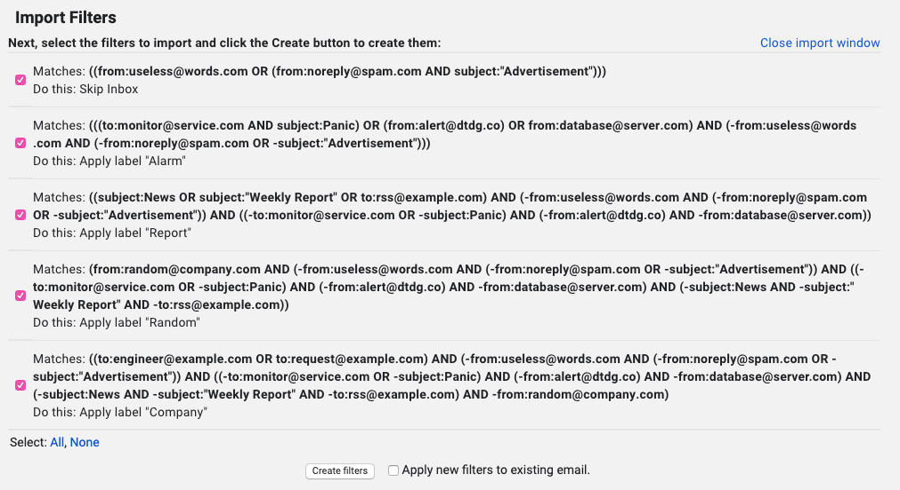

# Pipelined Gmail Filter Generator

Filters in gmail are work independently. So it's really hard to filtering out mails sequentially. This tool helps you make gmail filters when....
> You have 100 mails 
> 
> Use the filter A and select 10 mails from 100 mails and give the label A
> 
> Use the filter B and select 10 mails from remaing 90 mails and give the label B
> 
> Use the filter C and select 10 mails from remaing 80 mails and give the label C
>
> ...
> 
> Select whole remaining mails and give the label "Others"


## How to use

It's pure python script. You don't need any installation 
step.

---

**example.py**
```python
from filter import Pipeline, Filter, Operation, Clause, AND, OR, Option


def main():
    Pipeline([
        Filter(
            'Ignore',
            Operation(OR, [
                Clause('from:useless@words.com'),
                Operation(AND, [
                    Clause('from:noreply@spam.com'),
                    Clause('subject:"Advertisement"'),
                ]),
            ]),
            Option(apply_label=False, skip_inbox=True),
        ),
        Filter(
            'Alarm',
            Operation(OR, [
                Operation(AND, [
                    Clause('to:monitor@service.com'),
                    Clause('subject:Panic'),
                ]),
                Operation(AND, [
                    Clause('from:alert@dtdg.co'),
                ]),
                Clause('from:database@server.com'),
            ]),
        ),
        Filter(
            'Report',
            Operation(OR, [
                Clause('subject:News'),
                Clause('subject:"Weekly Report"'),
                Clause('to:rss@example.com'),
            ]),
        ),
        Filter(
            'Random',
            Clause('from:random@company.com'),
        ),
        Filter(
            'Company',
            Operation(OR, [
                Clause('to:engineer@example.com'),
                Clause('to:request@example.com'),
            ]),
        ),
    ]).save('output.xml')


main()
```
---
**run**
```
$ python example.py

Ignore -- ((from:useless@words.com OR (from:noreply@spam.com AND subject:"Advertisement")))

Alarm -- (((to:monitor@service.com AND subject:Panic) OR (from:alert@dtdg.co) OR from:database@server.com) AND (-from:useless@words.com AND (-from:noreply@spam.com OR -subject:"Advertisement")))

Report -- ((subject:News OR subject:"Weekly Report" OR to:rss@example.com) AND (-from:useless@words.com AND (-from:noreply@spam.com OR -subject:"Advertisement")) AND ((-to:monitor@service.com OR -subject:Panic) AND (-from:alert@dtdg.co) AND -from:database@server.com))

Random -- (from:random@company.com AND (-from:useless@words.com AND (-from:noreply@spam.com OR -subject:"Advertisement")) AND ((-to:monitor@service.com OR -subject:Panic) AND (-from:alert@dtdg.co) AND -from:database@server.com) AND (-subject:News AND -subject:"Weekly Report" AND -to:rss@example.com))

Company -- ((to:engineer@example.com OR to:request@example.com) AND (-from:useless@words.com AND (-from:noreply@spam.com OR -subject:"Advertisement")) AND ((-to:monitor@service.com OR -subject:Panic) AND (-from:alert@dtdg.co) AND -from:database@server.com) AND (-subject:News AND -subject:"Weekly Report" AND -to:rss@example.com) AND -from:random@company.com)


Done. go to Gmail[https://mail.google.com/mail/u/0/#settings/filters] and import output.xml
```
**output.xml**
```xml
<?xml version="1.0" ?>
<feed xmlns="http://www.w3.org/2005/Atom" xmlns:apps="http://schemas.google.com/apps/2006">
	<title>Mail Filters</title>
	<entry>
		<category term="filter"/>
		<title>Mail Filters</title>
		<content/>
		<apps:property name="hasTheWord" value="((from:useless@words.com OR (from:noreply@spam.com AND subject:&quot;Advertisement&quot;)))"/>
		<apps:property name="shouldArchive" value="true"/>
		<apps:property name="sizeOperator" value="s_sl"/>
		<apps:property name="sizeUnit" value="s_smb"/>
	</entry>
	<entry>
		<category term="filter"/>
		<title>Mail Filters</title>
		<content/>
		<apps:property name="hasTheWord" value="(((to:monitor@service.com AND subject:Panic) OR (from:alert@dtdg.co) OR from:database@server.com) AND (-from:useless@words.com AND (-from:noreply@spam.com OR -subject:&quot;Advertisement&quot;)))"/>
		<apps:property name="label" value="Alarm"/>
		<apps:property name="sizeOperator" value="s_sl"/>
		<apps:property name="sizeUnit" value="s_smb"/>
	</entry>
	<entry>
		<category term="filter"/>
		<title>Mail Filters</title>
		<content/>
		<apps:property name="hasTheWord" value="((subject:News OR subject:&quot;Weekly Report&quot; OR to:rss@example.com) AND (-from:useless@words.com AND (-from:noreply@spam.com OR -subject:&quot;Advertisement&quot;)) AND ((-to:monitor@service.com OR -subject:Panic) AND (-from:alert@dtdg.co) AND -from:database@server.com))"/>
		<apps:property name="label" value="Report"/>
		<apps:property name="sizeOperator" value="s_sl"/>
		<apps:property name="sizeUnit" value="s_smb"/>
	</entry>
	<entry>
		<category term="filter"/>
		<title>Mail Filters</title>
		<content/>
		<apps:property name="hasTheWord" value="(from:random@company.com AND (-from:useless@words.com AND (-from:noreply@spam.com OR -subject:&quot;Advertisement&quot;)) AND ((-to:monitor@service.com OR -subject:Panic) AND (-from:alert@dtdg.co) AND -from:database@server.com) AND (-subject:News AND -subject:&quot;Weekly Report&quot; AND -to:rss@example.com))"/>
		<apps:property name="label" value="Random"/>
		<apps:property name="sizeOperator" value="s_sl"/>
		<apps:property name="sizeUnit" value="s_smb"/>
	</entry>
	<entry>
		<category term="filter"/>
		<title>Mail Filters</title>
		<content/>
		<apps:property name="hasTheWord" value="((to:engineer@example.com OR to:request@example.com) AND (-from:useless@words.com AND (-from:noreply@spam.com OR -subject:&quot;Advertisement&quot;)) AND ((-to:monitor@service.com OR -subject:Panic) AND (-from:alert@dtdg.co) AND -from:database@server.com) AND (-subject:News AND -subject:&quot;Weekly Report&quot; AND -to:rss@example.com) AND -from:random@company.com)"/>
		<apps:property name="label" value="Company"/>
		<apps:property name="sizeOperator" value="s_sl"/>
		<apps:property name="sizeUnit" value="s_smb"/>
	</entry>
</feed>
```
[Go to gmail setting page.](https://mail.google.com/mail/u/0/#settings/filters)


---
Finally, import this file on the gmail filter settings.
